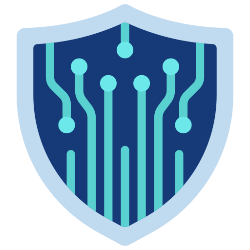
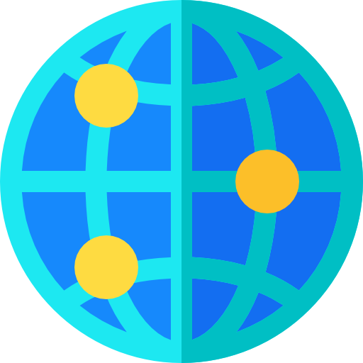

#  Hi, I'm Abdu Al Ghiffari

##  About Me

Hi, I'm **Abdu Al Ghiffari**, an Informatics Engineering student at **Lhokseumawe State Polytechnic**, based in **Aceh, Indonesia**.

My areas of expertise include:

-  **Cyber Security**
-  **Web Development**
-  **Data Analysis**
-  **Machine Learning**

## Socials:

## 🛠 Programming Languages

## Web Development

##  Machine Learning & Data Science

##  Cloud

## Database

## 🛠 Tools

# 📊 GitHub Stats:
 
 

---

## 🐍 Contribution Snake

  

